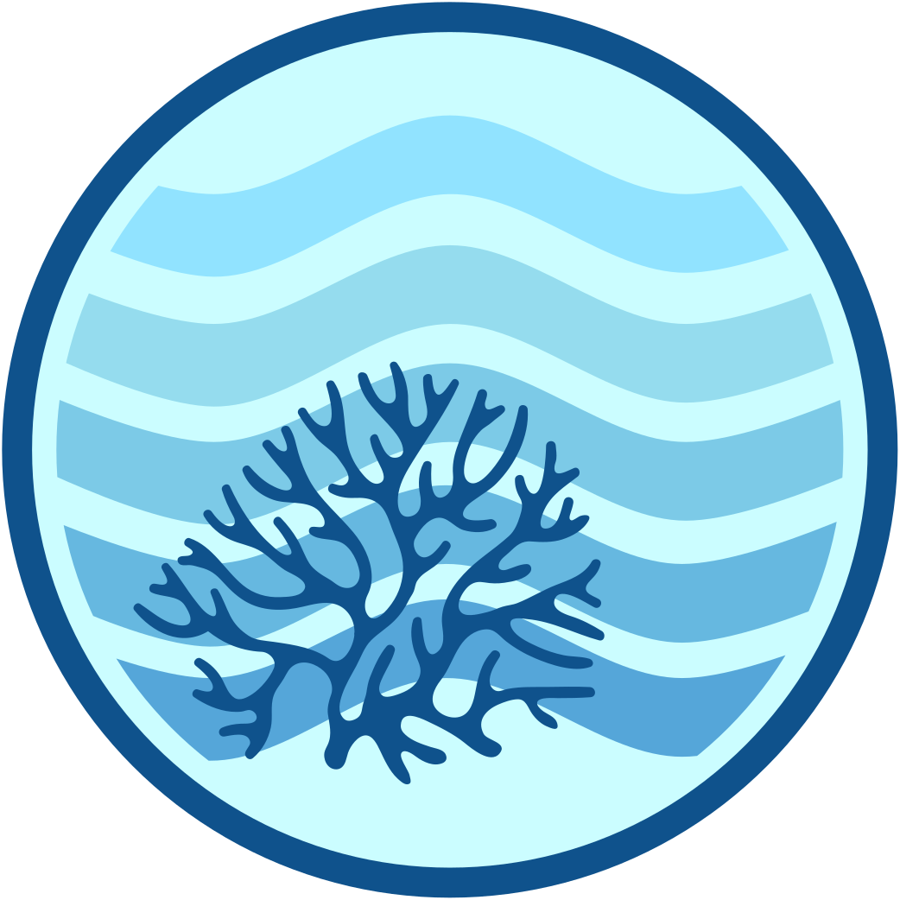

# eReefs Visual Identity

So that the many and varied components of the eReefs Platform appear to be related, user interfaces should attempt to share a common visual identity which involves using a consistent set of logos, fonts and colours, and (if possible) to share a common primary navigation menu.

- [Colours](#colours)
- [Fonts](#fonts)
  - [Heading font (but not site-banner)](#heading-font-but-not-site-banner)
  - [Text Font (and also site-banner)](#text-font-and-also-site-banner)
  - [Code Font](#code-font)
- [Logos](#logos)
  - [Main Logo](#main-logo)
  - [Favicon Logo](#favicon-logo)
- [Background Images](#background-images)
- [Stylesheets](#stylesheets)
- [Layout](#layout)
  - [Favicon](#favicon)
  - [Header / Titlebar](#header--titlebar)
  - [Banner Logo](#banner-logo)
  - [Primary Navigation Links](#primary-navigation-links)
  - [Page Footer](#page-footer)


---

## Colours

eReefs websites should prefer the following HTML colours:


| Label | Hex Code | Use for |
|-------|----------|---------|
| white | `#ffffff` <span style="background-color:#ffffff;">&nbsp;&nbsp;&nbsp;</span> |  <ul><li>**backgrounds:**<ul><li>page content</li><li>odd-numbered table rows</li></ul><li>**text**: body text over dark backgrounds</li></ul> |
| ereefs-darkest-blue | `#212529` <span style="background-color: #212529;">&nbsp;&nbsp;&nbsp;</span> |  <ul><li>**text**: body text over light backgrounds</li></ul> |
| ereefs-dark-blue | `#0F528C` <span style="background-color: #0F528C;">&nbsp;&nbsp;&nbsp;</span> |     <ul><li>**backgrounds:** <ul><li>header / titlebar</li><li>footer</li><li>navigation tiles</li><li>normal/visited buttons over light backgrounds</li><li>coral in logo</li></ul><li>**borders:** logo, table, legend, content</li><li>**text**: normal/visited links</li></ul> |
| ereefs-light-blue | `#55A6D9`  <span style="background-color: #55A6D9;">&nbsp;&nbsp;&nbsp;</span> | <ul><li>**backgrounds:** <ul><li>normal/visited buttons over dark backgrounds</li><li>active/hover/focus buttons over light backgrounds</li><li>deepest wave in logo</li></ul><li>**text:** active/hover/focus link text</li></ul> |
| ereefs-lightest-blue | `#CBFDFF` <span style="background-color: #CBFDFF;">&nbsp;&nbsp;&nbsp;</span> | <ul><li>**backgrounds:** message zone</li><li>**logo:** background</li></ul> |
| ereefs-dark-grey | `#707070` <span style="background-color: #707070;">&nbsp;&nbsp;&nbsp;</span> | <ul><li>**backgrounds:** disabled buttons</li><li>**borders:** horizontal rules</li><li>**text:** non-emphasised table/legend content</li></ul> |
| ereefs-light-grey | `#CFDCE8` <span style="background-color: #CFDCE8;">&nbsp;&nbsp;&nbsp;</span> | <ul><li>**backgrounds:**<ul><li>page background behind white content backgrounds</li><li>even-numbered table rows</li></ul></ul> |
&nbsp;

## Fonts

eReefs websites should make use of the following fonts:

### Heading font (but not site-banner)

[Open Sans Condensed](https://fonts.google.com/specimen/Open+Sans#standard-styles)

```css
@import "https://fonts.googleapis.com/css?family=Open+Sans+Condensed:300,700";

h1, h2, h3, h4, h5, h6 {
  font-family: 'Open Sans Condensed','Open Sans',sans-serif;
}
``` 

&nbsp;

### Text Font (and also site-banner)

[Roboto](https://fonts.google.com/specimen/Roboto#standard-styles)

```css
@import "https://fonts.googleapis.com/css2?family=Roboto";

body,
.banner h1 {
  font-family: Roboto,'Helvetica Neue',Helvetica,Arial,sans-serif;
}
```
&nbsp;

### Code Font

Any monospaced font is acceptable:

```css
code, pre, var {
  font-family: Menlo, "DejaVu Sans Mono", "Ubuntu Mono", Courier, "Courier New", monospace, sans-serif;
}
```

## Logos

The official eReefs Logo image files can be found in this repository at [docs/assets/images/logos/](./docs/assets/images/logos/),  and referenced at runtime at <https://www.ereefs.org.au/assets/images/logos/>.

### Main Logo

The main logo should be used in website titlebars and anywhere else that eReefs is referenced and the image is allowed to be more than 50px in width. Prefer the SVG (vector) variant where possible, or use the PNG if your application can only handle raster image formats.

The 'banner' variant includes white 'eReefs' text, and can be used in cases where it is not possible to inject both an image and text into an existing web page.  Keeping the image and banner-text seperate is much more accessible for users with screen readers, so only use this if it's truly necessary.

| MIME Type | Preview	| URL | Size |
|-----------|-----------|-----|------|
| `image/svg+xml` |  | <https://www.ereefs.org.au/assets/images/logos/ereefs_logo.svg> | N/A: should autoscale as needed. Works very large (e.g. t-shirt scale) |
|`image/png` |  | <https://www.ereefs.org.au/assets/images/logos/ereefs_logo.png> | width=250px, height=250px, 300DPI |
| `image/png` |  | <https://www.ereefs.org.au/assets/images/logos/ereefs_banner.png> | width=401px, height=120px, 300DPI |


### Favicon Logo

This logo variant is designed to work better at small image sizes than the main logo, and it should be used where a logo image smaller than 50px in width / height is needed. It is primarily intended as a website favicon, but may be used elsewhere.  

Prefer the .svg (vector) variant where possible, or use the .png if your application can only handle raster image formats, or the .ico if your application really wants an old-school icon file.

| MIME Type | Preview	| URL | Size |
|-----------|-----------|-----|------|
| `image/svg+xml` |  | <https://www.ereefs.org.au/assets/images/logos/ereefs_logo_favicon.svg> |  N/A: should autoscale as needed |
| `image/png` |  | <https://www.ereefs.org.au/assets/images/logos/ereefs_logo_favicon.png> |  w=32px, h=32px, 300DPI |
| `image/x-icon` |  | <https://www.ereefs.org.au/assets/images/logos/ereefs_logo_favicon.ico> |  w=32px, h=32px, 300DPI |

&nbsp;

## Background Images

This repository includes a number of stock-photo background images that can be used as required.

These are available in the [docs/assets/images/backgrounds/](./docs/assets/images/backgrounds/) subdirectory.

Please ensure you properly attribute the photographer in a caption if you use any of these!

| MIME Type | Preview & URL | Size | Attribution | Used on |
|-----------|---------------|------|-------------|---------|
|`image/jpeg` |  <https://www.ereefs.org.au/assets/images/backgrounds/hardy-reef.jpg> <https://www.ereefs.org.au/assets/images/backgrounds/hardy-reef-small.jpg> | **Full Size:** w=1500px, h=1001px<br/><br/>**Small:** w=385px, h=256px, 96 DPI | Aerial view of Hardy Reef, Jumbo Aerial Photography, © [Commonwealth of Australia (GBRMPA)](http://www.gbrmpa.gov.au/) | eReefs platform tools |
|`image/jpeg` |  <https://www.ereefs.org.au/assets/images/backgrounds/ereefs_home_header_0937_q60.jpg> | w=2362px, h=268px, 300 DPI | Gary Cranitch © [Queensland Museum](https://www.museum.qld.gov.au) | eReefs home page, contacts page, error page(s) |
|`image/jpeg` |  <https://www.ereefs.org.au/assets/images/backgrounds/ereefs_about_header_2253_q75.jpg> | w=2362px, h=268px, 300 DPI | Gary Cranitch © [Queensland Museum](https://www.museum.qld.gov.au) | "About eReefs" pages |
|`image/jpeg` |  <https://www.ereefs.org.au/assets/images/backgrounds/ereefs_research_header_2688_q60.jpg> | w=2362px, h=268px, 300 DPI | Gary Cranitch © [Queensland Museum](https://www.museum.qld.gov.au) | "eReefs Research" pages |
|`image/jpeg` |  <https://www.ereefs.org.au/assets/images/backgrounds/ereefs_tools_header_8243_q60.jpg> | w=2362px, h=268px, 300 DPI | Gary Cranitch © [Queensland Museum](https://www.museum.qld.gov.au) | "eReefs Tools" pages |

&nbsp;

## Stylesheets

A number of Cascading Stylesheets have been included in this repository to assist with applying the eReefs visual identity to websites that are included in the eReefs platform.  These can be included in another website via a Stylesheet link in the page's `head` element:

```html
<head>
  <link rel="stylesheet" href="https://www.ereefs.org.au/assets/css/ereefs-reset.css" />
</head>

```

Or they can be imported from another stylesheet which is already used by your application:

```css
@import "https://www.ereefs.org.au/assets/css/ereefs-reset.css";
```

The following stylesheets are available for reference and re-use:

| Stylesheet | Purpose | 
|------------|---------|
| [ereefs-reset.css](./docs/assets/css/ereefs-reset.css) | This is a [HTML Reset stylesheet](https://www.webfx.com/blog/web-design/css-reset-stylesheets/).  It configures fonts, text sizes and colours for standard HTML elements so that they fit the eReefs visual identity and appear consistently in most major browsers.  It does NOT assume any particular page layout, but does tweak the box-model, so may not be suitable to use in combination with all legacy web pages. |
| [ereefs-overrides.css](./docs/assets/css/ereefs-overrides.css) | Override styles for a GitHub Pages website that uses the [Minimal Mistakes](https://mmistakes.github.io/minimal-mistakes/docs/quick-start-guide/) theme (i.e. the website from this repository) |
| [edas-dashboard.css](./docs/assets/css/edas-dashboard.css) | Applies the eReefs Visual Identity to a website derived from CSIRO's Environmental Data Application Stack (EDAS) dashboard software. |
| [flask-rest-swagger.css](./docs/assets/css/flask-rest-swagger.css) | Applies the eReefs Visual Identity to swagger documentation autogenerated for a [Flask-RESTful API](https://flask-restful.readthedocs.io/en/latest/) |
| [godiva.css](./docs/assets/css/godiva.css) | Applies the eReefs Visual Identity to the [Godiva3 ncWMS2 viewer](https://reading-escience-centre.gitbooks.io/ncwms-user-guide/content/04-usage.html#godiva3) that comes packaged with the [THREDDS](https://www.unidata.ucar.edu/software/tds/) and [Hyrax](https://www.opendap.org/software/hyrax-data-server) data servers |
| [grafana.css](./docs/assets/css/grafana.css) | Applies the eReefs Visual Identity to a [Grafana dashboard](https://grafana.com/grafana/) |
| [opendap.css](./docs/assets/css/opendap.css) | Applies the eReefs Visual Identity to the OPeNDAP GUI that comes packaged with the [Hyrax](https://www.opendap.org/software/hyrax-data-server) data server |
| [tds4Catalog.css](./docs/assets/css/tds4Catalog.css) | Applies the eReefs Visual Identity to [THREDDS 4](https://docs.unidata.ucar.edu/tds/4.6/adminguide/) Catalog pages |
| [tds4Dataset.css](./docs/assets/css/tds4Dataset.css) | Applies the eReefs Visual Identity to [THREDDS 4](https://docs.unidata.ucar.edu/tds/4.6/adminguide/) Dataset page |
| [tds5.css](./docs/assets/css/tds5.css) | Applies the eReefs Visual Identity to [THREDDS 5](https://www.unidata.ucar.edu/software/tds/) Catalog and Dataset pages |
| [tdsDap.css](./docs/assets/css/tdsDap.css) | Applies the eReefs Visual Identity to [THREDDS 4](https://docs.unidata.ucar.edu/tds/4.6/adminguide/) or [THREDDS 5](https://www.unidata.ucar.edu/software/tds/) OPeNDAP Endpoint GUI pages. |

&nbsp;

## Layout

The various websites that make up the eReefs platform are implemented in all sorts of different technologies and serve different purposes, and it is impractical to enforce a common layout on all of them.

In *general*, though, websites should include the following elements:

### Favicon

All eReefs websites should use the [eReefs favicon logo](./docs/assets/images/logos/ereefs_logo_favicon.ico) as the favicon for the site.

### Header / Titlebar

A titlebar should be displayed at the top of the page that has white text on an `ereefs-dark`-coloured background.

### Banner Logo

The eReefs Logo and the word 'eReefs' in bold, white text should be displayed on the left-hand end of the titlebar.   The logo may link either to the main eReefs homepage (<https://www.ereefs.org.au>) or to the landing page of that particular website.

The logo should be a minimum of 50px high.

### Primary Navigation Links

All eReefs websites should include a set of common navigation links to allow users to return to this main eReefs website from any other page in the eReefs platform.

If the layout permits, these should be displayed on the righthand side of the titlebar at the very top of the page, and should collapse to a drop-down list for mobile devices.

For the title and URL of each of these primary / common navigation links, please refer to the `main` entry in the navigation definition for this website: [docs/_data/navigation.yml](./docs/_data/navigation.yml)

### Page Footer

If possible, all eReefs websites should have a common-page footer that has an `ereefs-dark`-coloured background and white text.  The footer should include links to any appropriate legal information like:

- A [privacy policy](https://www.csiro.au/en/About/Access-to-information/Privacy) 
- A [legal notice and disclaimer](https://www.csiro.au/en/About/Footer/Legal-notice)
